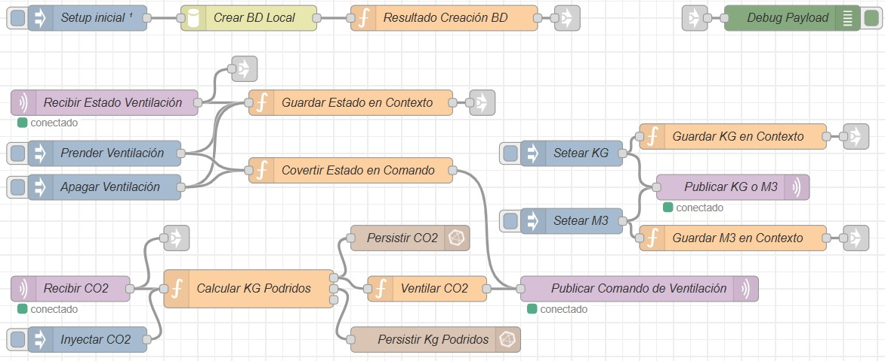
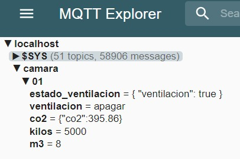
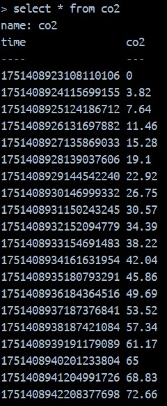
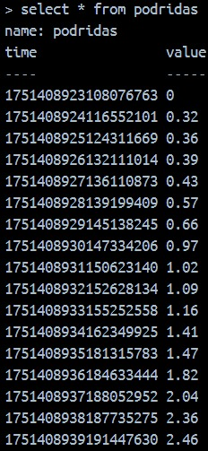
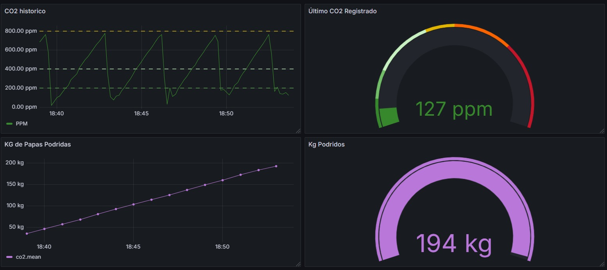

# Simulación y Control de CO2 en Cámara de Papas - Trabajo Final IOT 2025

## Integrantes

- **Ignacio Traberg** - Legajo: 18244/3
- **Martín Tau** - Legajo: 7881/8

---

## Descripción del Proyecto

Este proyecto simula el funcionamiento de una cámara de almacenamiento de papas, donde se controla la ventilación en base a la concentración de CO2. El sistema está desarrollado para la materia *Internet de las Cosas (2025)* y utiliza herramientas industriales IoT para lograr una solución robusta y monitoreable.

El **ESP32** simula la generación de CO2 en función de la cantidad de papas (normales y podridas) y el volumen de la cámara, publicando periódicamente el valor de CO2 a un **broker MQTT**. Node-RED recibe estos datos, los almacena en **InfluxDB** y permite visualizar el histórico y el estado en tiempo real mediante **Grafana**. Además, desde Node-RED se pueden enviar comandos al ESP32 para:

- Activar/desactivar la ventilación.
- Modificar la cantidad de papas (kg).
- Modificar el volumen de la cámara (m³).

El sistema permite experimentar en tiempo real cómo varía el CO2 según los parámetros y el estado de la ventilación.

---

## Tecnologías Utilizadas

- **ESP32**
- **MQTT (Mosquitto)**
- **Node-RED**
- **InfluxDB**
- **Grafana**
- **Docker Compose**
- Lenguaje: **C++**

---

## Capturas de Pantalla
  
* _Node-RED_
  


* _MQTT Explorer_
  


* _InfluxDB_
  
 

* _Grafana_
  



---

## Estructura del Proyecto

```
IOT_2025/
├── docker-compose.yml         # Orquestación de servicios (Node-RED, Mosquitto, InfluxDB, Grafana)
├── grafana/                   # Configuración inicial de dashboards (opcional)
├── node-red-data/             # Flujos y datos persistentes de Node-RED
├── mosquitto/                 # Configuración y datos de Mosquitto
├── telegraf/                  # Configuración de Telegraf (opcional)
├── esp32_mock/                # Mock de ESP32 en Node.js (opcional)
├── resources/                 # Capturas de las tecnologías utilizadas
├── sketch/                    # Código fuente del ESP32
│   ├── CO2Sensor.cpp
│   ├── CO2Sensor.h
│   ├── HumSensor.cpp
│   ├── HumSensor.h
│   ├── WifiConn.cpp
│   ├── WifiConn.h
│   ├── MqttClient.cpp
│   ├── MqttClient.h
│   ├── config.h
│   ├── env.h
│   ├── env.h.example
│   └── sketch.ino
├── wokwi/                     # Proyecto de simulación en Wokwi
│   ├── diagram.json
│   └── wokwi-project.txt
├── .gitignore
└── README.md                  # Este archivo
```

---

## Contenedores

- Basado en: https://gitlab.com/dgraselli/stack-nodered-mqtt/-/tree/master
- Para levantar contenedores:
```shell
docker compose up -d
```
Una vez levantado los contenedores, ingresar a NodeRed (http://localhost:1880/) e instalar las paletas:
- node-red-contrib-influxdb

---


## Flujo de Datos y Control

1. **ESP32** simula y publica el valor de CO2 en el tópico MQTT `camara/<ID>/co2` cada 5 segundos.
2. **Node-RED**:
   - Se suscribe a `camara/<ID>/co2` y almacena los datos en **InfluxDB**.
   - Permite visualizar y analizar el histórico y el estado actual en **Grafana**.
   - Permite enviar comandos al ESP32 mediante los siguientes tópicos:
     - `camara/<ID>/ventilacion` ("prender"/"apagar")
     - `camara/<ID>/kilos` (float, kilos de papas)
     - `camara/<ID>/m3` (float, volumen de la cámara)
3. **ESP32** recibe estos comandos y ajusta la simulación en tiempo real:
   - Cambia el estado de la ventilación (afectando la concentración de CO2)
   - Modifica la cantidad de papas o el volumen de la cámara
4. **Grafana** consulta InfluxDB y presenta los datos de CO2 en tiempo real o históricos.

---


## Notas

- El archivo `./sketch/env.h` debe contener las credenciales necesarias para conectar el ESP32 a la red Wi-Fi y al broker MQTT.
- `config.h` define constantes como los umbrales de CO2, tiempo entre publicaciones, etc.
- El entorno completo puede correr en Docker (`docker-compose.yml`).
- Para ver los dashboards, acceder a Grafana (`localhost:3000`).

---

## Simulación de Variables

- El valor de CO2 se simula en función de la cantidad de papas, el volumen de la cámara y el estado de la ventilación.
- Se puede modificar en tiempo real la cantidad de papas y el volumen desde Node-RED.
- El sistema permite experimentar el efecto de la ventilación sobre la concentración de CO2.
