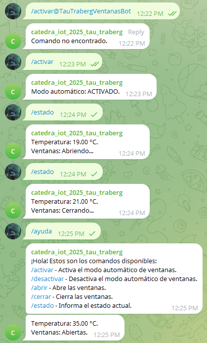
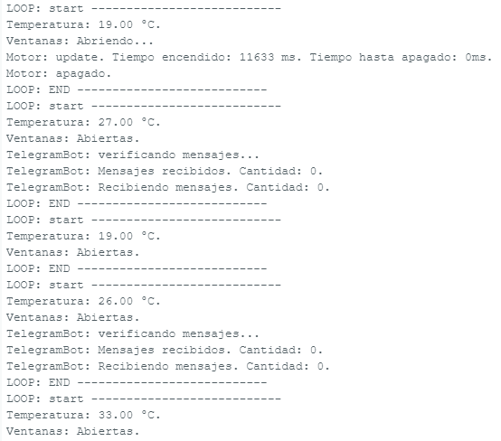

# Bot de Control de Ventanas por Temperatura

## Integrantes

- **Ignacio Traberg** - Legajo: 18244/3  
- **Martín Tau** - Legajo: 7881/8

---

## Descripción del Proyecto

Este proyecto consiste en un sistema de control automatizado de ventanas basado en la lectura de temperatura ambiente mediante un **ESP32** y comunicación con un bot de **Telegram**. El objetivo es simular un entorno de domótica donde las ventanas se abren o cierran automáticamente, según la temperatura, y los usuarios pueden consultar y operar el sistema a través de comandos por chat.

Entre las principales funcionalidades:

- Lectura de temperatura (mockeada en esta versión de pruebas).
- Control de apertura/cierre de ventanas simulado.
- Notificaciones automáticas al grupo de Telegram con el estado del sistema.
- Respuesta a comandos enviados por usuarios autorizados.
- Gestión de conexión WiFi robusta y controlada.
- Código modular y orientado a objetos.

---

## Tecnologías Utilizadas

- **ESP32 DevKit V1**  
- **Arduino IDE**  
- **Librerías**:
  - `UniversalTelegramBot` (v1.3.0)
  - `WiFi.h` / `WiFiClientSecure.h`
  - `DHT.h` (simulada)
- Lenguaje: **C++**

---

## Capturas de Pantalla

### · Interacción del bot en el grupo de Telegram

### · Ejecución en consola del Arduino IDE

---

## Estructura del Proyecto

IOT_2025/
├── sketch/
│ ├── config.h
│ ├── MotorDriver.cpp / .h
│ ├── TempSensor.cpp / .h
│ ├── TelegramBot.cpp / .h
│ ├── WifiConn.cpp / .h
│ └── sketch.ino
├── env.h
├── README.md
├── wokwi-project.txt
└── diagram.json

---

## Comandos Disponibles en Telegram

- `/ayuda` → Devuelve una lista de los comandos disponibles.  
- `/estado` → Consulta temperatura actual y estado de las ventanas.  
- `/activar` / `/desactivar` → Controla el modo automático.  
- `/abrir` / `/cerrar` → Determina el estado de las ventanas, desactivando a su vez el modo automático.  

---

## Notas

- Las temperaturas en esta versión están simuladas mediante un generador aleatorio (`random()`).
- El sistema distingue usuarios válidos por su chat ID.
- El bot puede operar en modo privado o grupal, según el modo de privacidad en BotFather.
- Se utilizó `WiFiClientSecure` para comunicación cifrada con la API de Telegram.

---
