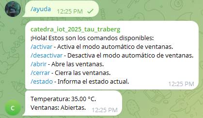
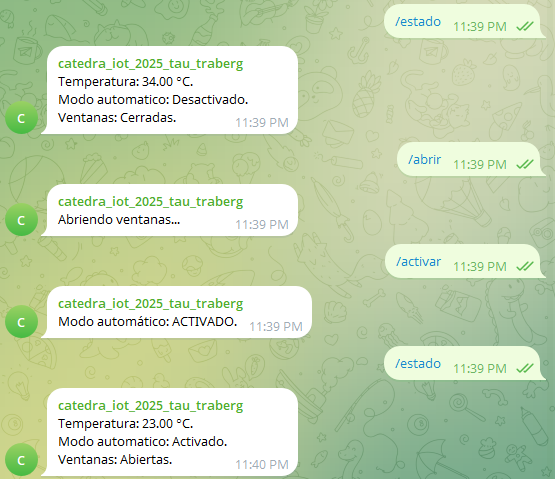

# Bot de Control de Ventanas por Temperatura

## Integrantes

- **Ignacio Traberg** - Legajo: 18244/3
- **Martín Tau** - Legajo: 7881/8

---

## Descripción del Proyecto

Este proyecto consiste en un sistema de control automatizado de ventanas basado en la lectura de temperatura ambiente
mediante un **ESP32** y comunicación con un bot de **Telegram**. El objetivo es simular un entorno de domótica donde las
ventanas se abren o cierran automáticamente, según la temperatura, y los usuarios pueden consultar y operar el sistema a
través de comandos por chat.

Entre las principales funcionalidades:

- Lectura de temperatura (mockeada en versión de pruebas).
- Control de apertura/cierre de ventanas simulado.
- Notificaciones automáticas a un grupo de Telegram con el estado del sistema.
- Respuesta a comandos enviados por usuarios autorizados.
- Gestión de conexión WiFi robusta y controlada.
- Código modular y orientado a objetos.

---

## Tecnologías Utilizadas

- **ESP32 DevKit V1**
- **Arduino IDE**
- **Librerías**:
    - `UniversalTelegramBot` (v1.3.0)
    - `WiFi.h` / `WiFiClientSecure.h`
    - `DHT.h` (o simulada)
- Lenguaje: **C++**

---

## Capturas de Pantalla

### · Interacción del bot en el grupo de Telegram





### · Ejecución en consola del Arduino IDE


---

## Estructura del Proyecto

```
IOT_2025/
├── resources/    # Recursos extra, no fuentes.
│ ├── Telegram.png    # Captura del bot funcionando
│ └── Terminal.png    # Captura de la consola del ESP32
├── sketch/   # Fuentes del proyecto (para Wokwi o IDE).
│ ├── config.h              # Valores de configuración.
│ ├── env.h                 # Valores secretos; Token, SSID y chat IDs.
│ ├── env.h.example         # Ejemplo de env.h para configurar.
│ ├── MotorDriver(.cpp/h)   # Módulo de control del motor.
│ ├── sketch.ino            # Programa principal.
│ ├── TelegramBot(.cpp/h)   # Módulo de gestión del Bot.
│ ├── TempSensor(.cpp/h)    # Módulo de control de temperatura.
│ └── WifiConn(.cpp/h)      # Módulo de control de WiFi.
├── wokwi/    # Archivos para proyecto simulador Wokwi.
│ ├── diagram.json        # Configuración para simulador Wokwi.
│ ├── libraries.txt       # Librerías utilizadas.
│ └── wokwi-project.txt   # Info proyecto Wokwi.
├── .gitignore
└── README.md   # Este archivo.
```

---

## Comandos Disponibles en Telegram

- `/ayuda` → Devuelve la lista de comandos disponibles.
- `/estado` → Informa la temperatura actual y el estado de las ventanas.
- `/activar` / `/desactivar` → Controla el modo automático.
- `/abrir` / `/cerrar` → Modifica manualmente el estado de las ventanas, desactivando a su vez el modo automático.

---

## Notas

- Para compilar el proyecto se debe copiar el archivo `./sketch/env.h.example` a `./sketch/env.h` y configurar los
  valores (token de Bot Telegram, identificadores de chat de Telegram, entre otros).
- Si no se conecta un sensor, las temperaturas se deben simular. Para esto modificar la constante `TEMP_MOCK` del
  archivo de configuración `./sketch/config.h`, seteando el valor a `true`. De esta forma, las temperaturas serán
  simuladas mediante un generador aleatorio (`random()`).
- En `./sketch/config.h` se puede también modificar el resto de los valores para configurar el proyecto (por ejemplo,
  cuál temperatura abre las ventanas y cuál las cierra, entre otros).
- El sistema distingue usuarios válidos por su chat ID (configurables).
- El bot puede operar en modo privado o grupal, según el modo de privacidad en BotFather.
- Se utilizó `WiFiClientSecure` para comunicación cifrada con la API de Telegram.

---
