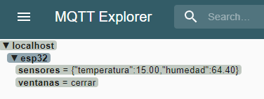
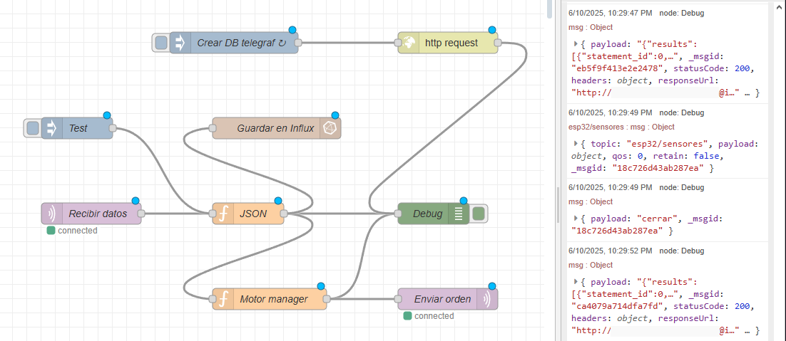
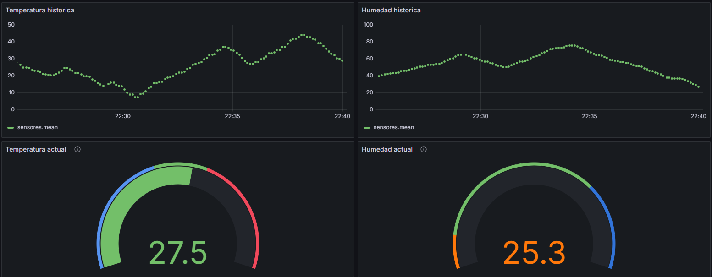

# Control de Ventanas por Temperatura - TP2  IOT 2025

## Integrantes

- **Ignacio Traberg** - Legajo: 18244/3
- **Martín Tau** - Legajo: 7881/8

---

## Descripción del Proyecto

Este proyecto corresponde a la **segunda parte** del sistema de control de ventanas basado en temperatura, desarrollado para la materia *Internet de las Cosas (2025)*. Se eliminó la automatización mediante Telegram y se incorporaron herramientas propias de entornos industriales IoT para lograr una solución robusta y monitoreable.

Se simula el comportamiento de un sistema donde un **ESP32** publica lecturas de **temperatura** y **humedad** a un **broker MQTT**, y **Node-RED** se encarga del procesamiento, ordenamiento y almacenamiento de los datos, incluyendo el control de apertura de las ventanas. La visualización histórica y en tiempo real se realiza mediante **InfluxDB** y **Grafana**.

Entre las funcionalidades principales:

- Simulación verosímil de variables físicas (temperatura y humedad).
- Publicación periódica al broker MQTT.
- Subscripción del ESP32 para recibir órdenes desde Node-RED (abrir/cerrar ventana).
- Almacenamiento histórico en base de datos InfluxDB.
- Visualización mediante dashboards en Grafana.
- Contenerización completa del entorno con Docker Compose.

---

## Tecnologías Utilizadas

- **ESP32 DevKit V1**
- **MQTT (Mosquitto)**
- **Node-RED**
- **InfluxDB**
- **Grafana**
- **Docker Compose**
- Lenguaje: **C++**

---

## Capturas de Pantalla

* _MQTT Explorer_
  

  
* _Node-RED_
  


* _InfluxDB_
  


* _Grafana_
  



---

## Estructura del Proyecto

```
IOT_2025/
├── docker/ # Archivos de definición de servicios para Docker
│ └── docker-compose.yml # Orquestación de servicios (Node-RED, Mosquitto, InfluxDB, Grafana)
├── grafana/ # Configuración inicial de dashboards (opcional)
├── node-red/ # Flujos exportados de Node-RED (.json)
├── sketch/ # Código fuente del ESP32
│ ├── config.h
│ ├── env.h
│ ├── env.h.example
│ ├── MotorDriver.cpp / .h
│ ├── sketch.ino
│ ├── TempSensor.cpp / .h
│ ├── HumSensor.cpp / .h
│ └── WifiConn.cpp / .h
├── resources/ # Capturas y otros recursos (vacío por ahora)
├── wokwi/ # Proyecto de simulación en Wokwi
│ ├── diagram.json
│ └── wokwi-project.txt
├── .gitignore
└── README.md # Este archivo
```

---

## Contenedor

- Las aplicaciones provistas por la cátedra son gestionadas en un contenedor de kubernetes, cuya imagen puede generarse con el archivo docker-compose.yaml del siguiente repositorio:
  - https://gitlab.com/dgraselli/stack-nodered-mqtt/-/tree/master

---


## Flujo de Datos

1. **ESP32** publica temperatura y humedad en un tópico MQTT "esp/sensores" cada 5 segundos. A su vez, se suscribe a "esp32/ventanas".
2. **Node-RED**:
   - Se suscribe a "esp32/sensores" y almacena los datos en **InfluxDB**.
   - Evalúa las condiciones de clima y para terperaturas debajo de los 20 o por encima de los 30 grados detectados, publica en el tópico "esp/ventanas" los mensajes "cerrar" o "abrir" respectivamente.
3. **ESP32** actúa según lo recibido en su suscripción a "esp32/ventanas" mediante el método _callback()_: ordenando al motor a abrir o cierrar las ventanas.
4. **Grafana** consulta InfluxDB y presenta los datos de temperatura y humedad en tiempo real o de forma histórica.

---

## Notas

- El archivo `./sketch/env.h` debe contener las credenciales necesarias para conectar el ESP32 a la red Wi-Fi y al broker MQTT.
- `config.h` define constantes como los umbrales de temperatura para abrir/cerrar la ventana, tiempo entre publicaciones, etc.
- La simulación de temperatura y humedad puede activarse según el entorno (real o Wokwi).
- El entorno completo puede correr en Docker (ver `docker-compose.yml` en el repositorio referenciado en este readme).
- Para ver los dashboards, acceder a Grafana (`localhost:3000`) y cargar el dashboard con la configuración guardada en _grafana.json_"_.

---

## Simulación de Variables

- Simula valores aleatórios entre **5°C y 45°C** y **10% y 90%** de humedad, de manera ligeramente cambiantes para gráficos no tan lineales.
